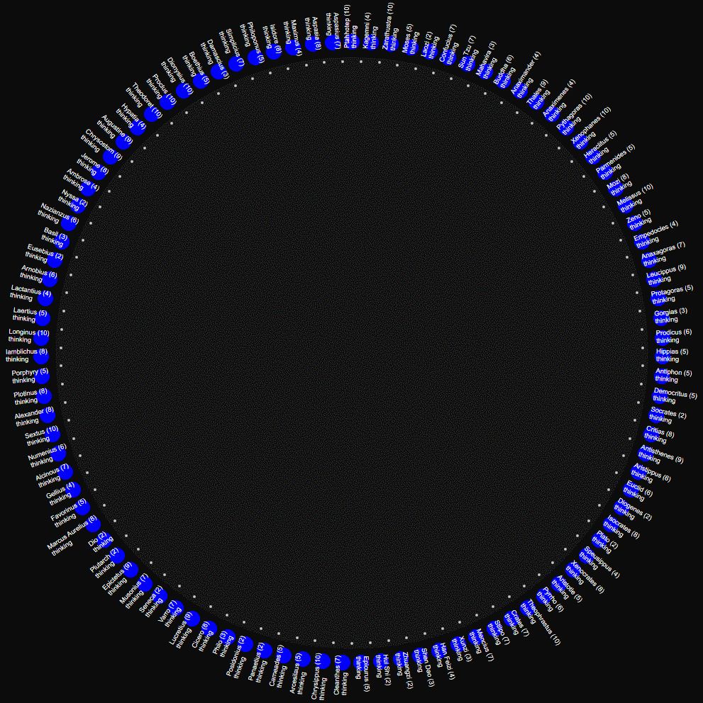

# Red Micro-Thread Scheduler

A lightweight, single-threaded cooperative runtime for [Red](https://www.red-lang.org/) featuring $O(1)$ task lookup, CSP-style bounded channels, actor-style direct mailboxes, and real-time execution telemetry.

---

## Key Features

* **Cooperative Multitasking:** Non-preemptive time-slice management optimized for Red's evaluation loop.
* **Hybrid Inter-Task Communication:**
* **CSP Channels:** Thread-safe, bounded queues (`make-channel`) for structured producer/consumer patterns.
* **Actor Mailboxes:** Direct message passing (`send-mail`) and global pub/sub (`broadcast`).


* **$O(1)$ Task Lookup:** Tasks managed via Red `map!` structures for constant-time target resolution by ID (`integer!`, `string!`, or `word!`).
* **Self-Contained Telemetry:** System-wide and per-task performance diagnostics, tracking CPU duration, execution counts, slice yields, and mail metrics.
* **Observer-Safe Lifecycle:** Tasks can trigger `self/finish` to cleanly capture final post-mortem metrics before returning execution to the scheduler loop.

---

## Architecture Overview

```
                          ┌───────────────────────────┐
                          │   SCHEDULER Step Loop     │
                          └─────────────┬─────────────┘
                                        │
                 ┌──────────────────────┴──────────────────────┐
                 ▼                                             ▼
       ┌──────────────────┐                          ┌──────────────────┐
       │   Task 1 ('ready)│                          │ Task 2 ('waiting)│
       └─────────┬────────┘                          └─────────┬────────┘
                 │ executes slice                              │ decrement tick
                 ▼                                             ▼
     ┌───────────────────────┐                    ┌─────────────────────────┐
     │ task-func / State Machine │                │ Ready when timer = 0    │
     └───────────┬───────────┘                    └─────────────────────────┘
                 │
  ┌──────────────┼─────────────────┬──────────────────┐
  ▼              ▼                 ▼                  ▼
'yield        'sleep            'finished         Channels / Mail
(next cycle)  (set wait state)  (self/finish)     (Inter-task IO)

```

Tasks yield control back to the scheduler using signals returned from `task-func`:

* `'yield` or `'continue`: Relinquishes the current time-slice or continues iteration within budget.
* `'sleep`: Suspends execution for a designated tick count or timestamp.
* `'finished`: Marks the task as completed (`'done`) and records final execution ticks.

---

## Quickstart Example

Save as `main.red` alongside `scheduler.red`:

```red
Red []

#include %scheduler.red

; 1. Create a bounded channel with capacity of 3
CHAN: make-channel 3

; 2. Spawn Producer Task
SCHEDULER/spawn 'READER 00:00:00.01 object [
    buf: none
    step: 'start
    
    task-func: func [/local self lines][
        self: SCHEDULER/task
        
        switch step [
            start [ 
                buf: ["Line 1" "Line 2" "Line 3"]
                step: 'push-channel 
                return 'yield 
            ]
            push-channel [ 
                CHAN/put take buf 
                step: 'check-eof 
                return 'yield 
            ]
            check-eof [ 
                either empty? buf [ step: 'how-many ] [ step: 'push-channel ]
                return 'yield
            ]
            how-many [ 
                self/send-mail 'PRINTER "How many lines?"
                step: 'check-count 
                return 'yield 
            ]
            check-count [ 
                either empty? lines: self/read-mail [
                    step: 'check-count 
                    return 'yield
                ][
                    print ["Total Lines Processed:" lines]
                    return self/finish/telemetry
                ] 
            ]
        ]
    ]
]

; 3. Spawn Consumer Task
SCHEDULER/spawn 'PRINTER 00:00:00.01 object [
    step: 1
    count: 0
    
    task-func: func [/local self item mail][
        self: SCHEDULER/task
        
        switch step [
            1 [ 
                unless CHAN/is-empty? [
                    item: CHAN/get
                    count: count + 1
                    print ["Printed:" item]
                ]
                step: 2 
                return 'yield
            ]
            2 [ 
                mail: self/read-mail 
                either mail = "How many lines?" [
                    self/send-mail 'READER form count
                    return self/finish/telemetry
                ][
                    step: 1 
                    return 'yield
                ]
            ]
        ]
    ]
]

; 4. Execute Scheduler Loop
SCHEDULER/run/tick-delay 00:00:00.01

```
## Visualization Example: 99 Dining Philosophers

---

## API Documentation

### 1. Scheduler Control (`SCHEDULER`)

| Function | Parameters | Description |
| --- | --- | --- |
| `spawn` | `id [integer! string! word!]`<br>

<br>`slice-duration [time!]`<br>

<br>`inner-obj [object!]` | Registers a new task wrapper into the engine. `inner-obj` must contain a `task-func`. |
| `run` | `/tick-delay delay [time!]` | Begins execution loop. Optional `/tick-delay` adds a wait step per tick cycle. |
| `stop` | *None* | Halts the active execution loop. |
| `reset` | *None* | Clears all registered tasks, resets metrics and global tick count to `0`. |
| `broadcast` | `msg [any-type!]` | Appends `msg` to the mailbox of all active (non-done) tasks. |
| `get-task` | `id [integer! string! word!]` | Returns the `task-wrapper` object corresponding to `id`. |
| `telemetry` | *None* | Returns a `map!` of system-wide scheduler execution diagnostics. |
| `task-telemetry` | `t [object!]` | Returns a `map!` of detailed performance diagnostics for task wrapper `t`. |

---

### 2. Task Context Methods (`self` inside task)

Every task wrapped by `SCHEDULER/spawn` has access to these context methods:

```red
self: SCHEDULER/task

```

| Method | Parameters | Description |
| --- | --- | --- |
| `send-mail` | `target [id]` `msg [any-type!]` | Pushes a message directly into the mailbox of `target`. |
| `read-mail` | *None* | Pops and returns the oldest message from the task's mailbox (`none` if empty). |
| `peek-mail` | *None* | Views the next pending message without removing it. |
| `publish` | `msg [any-type!]` | Broadcasts `msg` to all tasks via `SCHEDULER/broadcast`. |
| `sleep-ticks` | `n [integer!]` | Transitions task state to `'waiting` for `n` scheduler ticks. |
| `sleep-until` | `t [time!]` | Transitions task state to `'waiting` until real time reaches `t`. |
| `finish` | `/telemetry` | Immediately sets task state to `'done'`, records completed tick/time, optionally probes `task-telemetry`, and returns `'finished`. |

---

### 3. Channel API (`make-channel`)

Created via `CHAN: make-channel <capacity>`.

| Method | Returns | Description |
| --- | --- | --- |
| `put val` | `logic!` | Appends `val` to buffer. Returns `true` if successful, `false` if buffer is full. |
| `get` | `any-type!` | Pops and returns the head item. Returns `none` if empty. |
| `peek` | `any-type!` | Inspects the head item without removing it. |
| `full?` | `logic!` | Returns `true` if channel has reached max capacity. |
| `is-empty?` | `logic!` | Returns `true` if buffer length is `0`. |
| `count` | `integer!` | Returns current number of unread items in buffer. |
| `clear-ch` | `block!` | Clears all items currently in the buffer. |
| `telemetry` | `map!` | Returns `map!` containing capacity, count, `total-puts`, and `total-gets`. |

---

## Telemetry Metrics Guide

### System Telemetry Map (`SCHEDULER/telemetry`)

```red
#[
    current-tick:        21               ; Total scheduler cycles elapsed
    total-tasks:         2                ; Total tasks managed by scheduler
    active-tasks:        0                ; Number of 'ready tasks
    waiting-tasks:       0                ; Number of 'waiting tasks
    done-tasks:          2                ; Number of completed tasks
    broadcast-count:     0                ; Total system-wide broadcast calls
	
    total-slices:        41               ; Sum of time-slice scheduling passes
    total-execs:         41               ; Total task-func evaluations

    avg-slice-cpu:       0:00:00.0006011  ; Average CPU time per slice
    total-cpu-time:      0:00:00.0246461  ; Cumulative task execution CPU time
    total-wall-time:     0:00:00.385642   ; Wall-clock duration of SCHEDULER/run
    cpu-utilization-pct: 6.39             ; (total-cpu-time / total-wall-time) * 100
]

```

### Task Telemetry Map (`SCHEDULER/task-telemetry`)

```red
#[
    id:                  PRINTER          ; Task identifier
    state:               done             ; Final task state ('ready, 'waiting, 'done)
    sleep-count:         0                ; Total explicit sleep calls
    mail-sent:           1                ; Direct messages sent
    mail-recv:           1                ; Direct messages read
    mailbox-pending:     0                ; Unread messages remaining
    broadcast-sent:      0                ; Pub/Sub broadcasts initiated

    created-tick:        0                ; Tick when task was spawned
    completed-tick:      20               ; Tick when task reached 'done state
    total-ticks:         20               ; Lifespan in scheduler ticks
    total-slices:        20               ; Times scheduled into execution block
    exec-count:          19               ; Total task-func calls executed
	
    budget-slice:        0:00:00.01       ; Time-slice allocation
    avg-slice-cpu:       0:00:00.0004545  ; Average CPU time spent per slice
    avg-exec-cpu:        0:00:00.0004785  ; Average CPU time per task-func call
    cpu-time:            0:00:00.0090919  ; Total CPU time consumed
    wall-time:           0:00:00.321481   ; Real-world elapsed duration
]

```

---

## License

Distributed under the MIT License. See `LICENSE` for details.